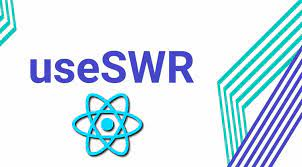

This Project uses the following Technologies: 

css, JavaScript, Nextjs Framework, Prisma with postgres as my database, AWS (Amazon web service), useSWR (Stale while
revalidating) hook for data fetching

### This is a screenshot of the Home Page on this site

 

### This is a screenshot of the Categories page

 

#### Description

This page uses prefetch for loading documents from database

## Getting setup on AWS

### Setting up s3 Buckets

1. Add a IAM role to your user:
   1. Go to the top search bar and search for IAM
   2. The first one that pops up should say IAM
   3. when you are on the IAM dashboard
   4. Under the IAM resource section
   5. There should be a heading that says Users
   6. click on users
   7. click on the user that you want to handle the s3 bucket
   8. click on Add permissions
   9. There will be 3 different policies
   10. click on the one that says, "Attach existing policies directly"
   11. in the search bar type s3 which should bring up all existing policies
   12. click on the policy that says, "AmazonS3FullAccess"
   13. which gives full access to the user
   14. keep on clicking the next blue button at the bottom to add the policy
2. Once the policy is added
3. In the search bar at the top type s3 to go to the s3 Dashboard
4. click the button that says create a bucket
5. type the name of the bucket
6. bear in mind that this name needs to be unique across the hole of aws
7. select what region you want your bucket to be in
8. under object ownership select ACL's enabled
9. unselect the Block all public access under the heading Block public access
10. all other setting you can leave as is, just click the orange button at the bottom
11. that says, "Create bucket"
12. once the bucket is created store your environment variables in the .env file
13. connect to the s3 bucket as I did in the server directory

